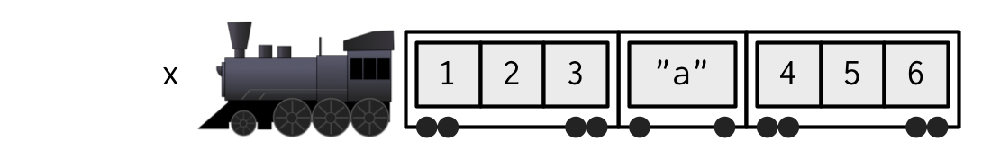
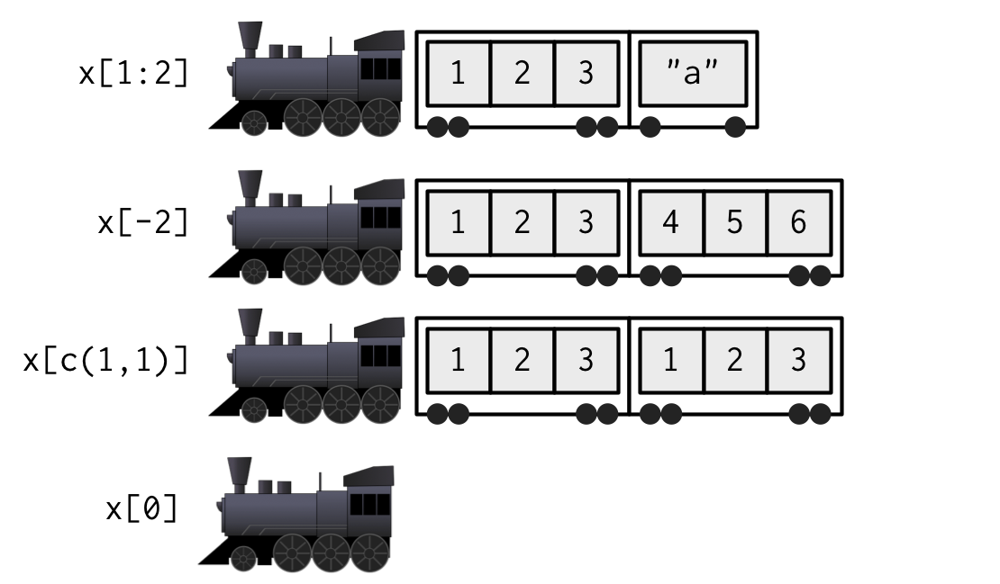

# Subsetting {#subsetting}


## Introduction
\index{subsetting}

R's subsetting operators are powerful and fast. Mastery of subsetting allows you to succinctly express complex operations in a way that few other languages can match. Subsetting is easy to learn but hard to master because you need to internalise a number of interrelated concepts:

* The six types of thing that you can subset with.

* The three subsetting operators, `[[`, `[`, and `$`.

* How the subsetting operators interact with vector types (e.g., 
  atomic vectors, lists, factors, matrices, and data frames).

* The use of subsetting together with assignment.

This chapter helps you master subsetting by starting with the simplest type of subsetting: subsetting an atomic vector with `[`. It then gradually extends your knowledge, first to more complicated data types (like arrays and lists), and then to the other subsetting operators, `[[` and `$`. You'll then learn how subsetting and assignment can be combined to modify parts of an object, and, finally, you'll see a large number of useful applications.

Subsetting is a natural complement to `str()`. `str()` shows you the structure of any object, and subsetting allows you to pull out the pieces that you're interested in. For large, complex objects, I also highly recommend the interactive RStudio Viewer, which you can activate with `View(my_object)`.

### Quiz {-}

Take this short quiz to determine if you need to read this chapter. If the answers quickly come to mind, you can comfortably skip this chapter. Check your answers in Section \@ref(subsetting-answers).

1.  What is the result of subsetting a vector with positive integers, 
    negative integers, a logical vector, or a character vector?

1.  What's the difference between `[`, `[[`, and `$` when applied to a list?

1.  When should you use `drop = FALSE`?

1.  If `x` is a matrix, what does `x[] <- 0` do? How is it different to
    `x <- 0`?

1.  How can you use a named vector to relabel categorical variables?

### Outline {-}

* Section \@ref(subset-multiple) starts by teaching you about `[`. You'll start
  by learning the six types of data that you can use to subset atomic vectors.
  You'll then learn how those six data types act when used to subset lists,
  matrices, and data frames.
  
* Section \@ref(subset-single) expands your knowledge of 
  subsetting operators to include `[[` and `$`, focussing on the important
  principles of simplifying vs. preserving.
  
* In Section \@ref(subassignment) you'll learn the
  art of subassignment, combining subsetting and assignment to modify parts 
  of an object.
  
* Section \@ref(applications) leads you through eight important, but
  not obvious, applications of subsetting to solve problems that you
  often encounter in a data analysis.

## Selecting multiple elements {#subset-multiple}

It's easiest to learn how subsetting works for atomic vectors, and then how it generalises to higher dimensions and other more complicated objects. We'll start with `[`, the most commonly used operator which allows you to extract any number of elements. Section \@ref(subset-single) will cover `[[` and `$`, used to extra a single element from a data structure.

### Atomic vectors
\index{subsetting!atomic vectors} 
\index{atomic vectors!subsetting} 
\indexc{[}

Let's explore the different types of subsetting with a simple vector, `x`. 


```r
x <- c(2.1, 4.2, 3.3, 5.4)
```

Note that the number after the decimal point gives the original position in the vector.

There are six things that you can use to subset a vector: 

*   __Positive integers__ return elements at the specified positions: 
    \index{subsetting!with positive integers}

    
    ```r
    x[c(3, 1)]
    #> [1] 3.3 2.1
    x[order(x)]
    #> [1] 2.1 3.3 4.2 5.4
    
    # Duplicated indices yield duplicated values
    x[c(1, 1)]
    #> [1] 2.1 2.1
    
    # Real numbers are silently truncated to integers
    x[c(2.1, 2.9)]
    #> [1] 4.2 4.2
    ```

*   __Negative integers__ omit elements at the specified positions:
    \index{subsetting!with negative integers}

    
    ```r
    x[-c(3, 1)]
    #> [1] 4.2 5.4
    ```

    You can't mix positive and negative integers in a single subset:

    
    ```r
    x[c(-1, 2)]
    #> Error in x[c(-1, 2)]:
    #>   only 0's may be mixed with negative subscripts
    ```

*   __Logical vectors__ select elements where the corresponding logical 
    value is `TRUE`. This is probably the most useful type of subsetting
    because you can write an expression that creates the logical vector:
    \index{subsetting!with logical vectors}

    
    ```r
    x[c(TRUE, TRUE, FALSE, FALSE)]
    #> [1] 2.1 4.2
    x[x > 3]
    #> [1] 4.2 3.3 5.4
    ```

    If the logical vector is shorter than the vector being subsetted, it 
    will be silently __recycled__ to be the same length.

    
    ```r
    x[c(TRUE, FALSE)]
    #> [1] 2.1 3.3
    # Equivalent to
    x[c(TRUE, FALSE, TRUE, FALSE)]
    #> [1] 2.1 3.3
    ```

    A missing value in the index always yields a missing value in the output:

    
    ```r
    x[c(TRUE, TRUE, NA, FALSE)]
    #> [1] 2.1 4.2  NA
    ```

*   __Nothing__ returns the original vector. This is not useful for 1d vectors,
    as you'll see shortly, is very useful for matrices, data frames, and arrays. 
    It can also be useful in conjunction with assignment.

    
    ```r
    x[]
    #> [1] 2.1 4.2 3.3 5.4
    ```

*   __Zero__ returns a zero-length vector. This is not something you 
    usually do on purpose, but it can be helpful for generating test data.

    
    ```r
    x[0]
    #> numeric(0)
    ```

*   If the vector is named, you can also use __character vectors__ to return  
    elements with matching names.
    \index{subsetting!with character vectors}

    
    ```r
    (y <- setNames(x, letters[1:4]))
    #>   a   b   c   d 
    #> 2.1 4.2 3.3 5.4
    y[c("d", "c", "a")]
    #>   d   c   a 
    #> 5.4 3.3 2.1
    
    # Like integer indices, you can repeat indices
    y[c("a", "a", "a")]
    #>   a   a   a 
    #> 2.1 2.1 2.1
    
    # When subsetting with [, names are always matched exactly
    z <- c(abc = 1, def = 2)
    z[c("a", "d")]
    #> <NA> <NA> 
    #>   NA   NA
    ```

### Lists
\index{lists!subsetting} 
\index{subsetting!lists}

Subsetting a list works in the same way as subsetting an atomic vector. Using `[` will always return a list; `[[` and `$`, as described in Section \@ref(subset-single), let you pull out the components of the list.  

### Matrices and arrays {#matrix-subsetting}
\index{subsetting!arrays} 
\index{arrays!subsetting}

You can subset higher-dimensional structures in three ways: 

* With multiple vectors.
* With a single vector.
* With a matrix.

The most common way of subsetting matrices (2d) and arrays (>2d) is a simple generalisation of 1d subsetting: you supply a 1d index for each dimension, separated by a comma. Blank subsetting is now useful because it lets you keep all rows or all columns.


```r
a <- matrix(1:9, nrow = 3)
colnames(a) <- c("A", "B", "C")
a[1:2, ]
#>      A B C
#> [1,] 1 4 7
#> [2,] 2 5 8
a[c(TRUE, FALSE, TRUE), c("B", "A")]
#>      B A
#> [1,] 4 1
#> [2,] 6 3
a[0, -2]
#>      A C
```

By default, `[` will simplify the results to the lowest possible dimensionality. You'll learn how to avoid this in Section \@ref(simplify-preserve).

Because matrices and arrays are just vectors with special attributes, you can subset them with a single vector, as if they were a 1d vector. Arrays in R are stored in column-major order:


```r
vals <- outer(1:5, 1:5, FUN = "paste", sep = ",")
vals
#>      [,1]  [,2]  [,3]  [,4]  [,5] 
#> [1,] "1,1" "1,2" "1,3" "1,4" "1,5"
#> [2,] "2,1" "2,2" "2,3" "2,4" "2,5"
#> [3,] "3,1" "3,2" "3,3" "3,4" "3,5"
#> [4,] "4,1" "4,2" "4,3" "4,4" "4,5"
#> [5,] "5,1" "5,2" "5,3" "5,4" "5,5"

vals[c(4, 15)]
#> [1] "4,1" "5,3"
```

You can also subset higher-dimensional data structures with an integer matrix (or, if named, a character matrix). Each row in the matrix specifies the location of one value, where each column corresponds to a dimension in the array being subsetted. This means that you use a 2 column matrix to subset a matrix, a 3 column matrix to subset a 3d array, and so on. The result is a vector of values:


```r
select <- rbind(
  c(1, 1),
  c(3, 1),
  c(2, 4)
)
vals[select]
#> [1] "1,1" "3,1" "2,4"
```

### Data frames and tibbles {#df-subsetting}
\index{subsetting!data frames} 
\index{data frames!subsetting}

Data frames possess the characteristics of both lists and matrices: if you subset with a single vector, they behave like lists; if you subset with two vectors, they behave like matrices. 


```r
df <- data.frame(x = 1:3, y = 3:1, z = letters[1:3])

df[df$x == 2, ]
#>   x y z
#> 2 2 2 b
df[c(1, 3), ]
#>   x y z
#> 1 1 3 a
#> 3 3 1 c

# There are two ways to select columns from a data frame
# Like a list, which
df[c("x", "z")]
#>   x z
#> 1 1 a
#> 2 2 b
#> 3 3 c
# Like a matrix
df[, c("x", "z")]
#>   x z
#> 1 1 a
#> 2 2 b
#> 3 3 c

# There's an important difference if you select a single 
# column: matrix subsetting simplifies by default, list 
# subsetting does not.
str(df["x"])
#> 'data.frame':	3 obs. of  1 variable:
#>  $ x: int  1 2 3
str(df[, "x"])
#>  int [1:3] 1 2 3
```

Subsetting a tibble with `[` always returns a tibble:


```r
df <- tibble::tibble(x = 1:3, y = 3:1, z = letters[1:3])

str(df["x"])
#> Classes 'tbl_df', 'tbl' and 'data.frame':	3 obs. of  1 variable:
#>  $ x: int  1 2 3
str(df[, "x"])
#> Classes 'tbl_df', 'tbl' and 'data.frame':	3 obs. of  1 variable:
#>  $ x: int  1 2 3
```

### Preserving dimensionality {#simplify-preserve}
\indexc{drop = FALSE} 
\index{subsetting!simplifying} 
\index{subsetting!preserving}

By default, any subsetting 2d data structures with a single number, single name, or a logical vector containing a single `TRUE` will simplify the returned output, i.e. it will return an object with lower dimensionality. To preserve the original dimensionality, you must use `drop = FALSE`

*   For matrices and arrays, any dimensions with length 1 will be dropped:
    
    
    ```r
    a <- matrix(1:4, nrow = 2)
    str(a[1, ])
    #>  int [1:2] 1 3
    
    str(a[1, , drop = FALSE])
    #>  int [1, 1:2] 1 3
    ```

*   Data frames with a single column will return just that column:

    
    ```r
    df <- data.frame(a = 1:2, b = 1:2)
    str(df[, "a"])
    #>  int [1:2] 1 2
    
    str(df[, "a", drop = FALSE])
    #> 'data.frame':	2 obs. of  1 variable:
    #>  $ a: int  1 2
    ```

*   Tibbles default to `drop = FALSE`, and `[` will never return a single 
    vector.

The default `drop = TRUE` behaviour is a common source of bugs in functions: you check your code with a data frame or matrix with multiple columns, and it works. Six months later you (or someone else) uses it with a single column data frame and it fails with a mystifying error. When writing functions, get in the habit of always using `drop = FALSE` when subsetting a 2d object.

Factor subsetting also has a `drop` argument, but the meaning is rather different. It controls whether or not levels are preserved (not the dimensionality), and it defaults to `FALSE` (levels are preserved, not simplified by default). If you find you are using `drop = TRUE` a lot it's often a sign that you should be using a character vector instead of a factor.


```r
z <- factor(c("a", "b"))
z[1]
#> [1] a
#> Levels: a b
z[1, drop = TRUE]
#> [1] a
#> Levels: a
```

### Exercises

1.  Fix each of the following common data frame subsetting errors:

    
    ```r
    mtcars[mtcars$cyl = 4, ]
    mtcars[-1:4, ]
    mtcars[mtcars$cyl <= 5]
    mtcars[mtcars$cyl == 4 | 6, ]
    ```

1.  Why does the following code yield five missing values? (Hint: why is 
    it different from `x[NA_real_]`?)
    
    
    ```r
    x <- 1:5
    x[NA]
    #> [1] NA NA NA NA NA
    ```
    
1.  What does `upper.tri()` return? How does subsetting a matrix with it 
    work? Do we need any additional subsetting rules to describe its behaviour?

    
    ```r
    x <- outer(1:5, 1:5, FUN = "*")
    x[upper.tri(x)]
    ```

1.  Why does `mtcars[1:20]` return an error? How does it differ from the 
    similar `mtcars[1:20, ]`?

1.  Implement your own function that extracts the diagonal entries from a
    matrix (it should behave like `diag(x)` where `x` is a matrix).

1.  What does `df[is.na(df)] <- 0` do? How does it work?

## Selecting a single element {#subset-single}
\index{subsetting!lists} 
\index{lists!subsetting}

There are two other subsetting operators: `[[` and `$`. `[[` is used for extracting single items, and `x$y` is a useful shorthand for `x[["y"]]`.

### `[[`
\indexc{[[} 

`[[` is most important working with lists because subsetting a list with `[` always returns a smaller list. To help make this easier to understand we can use a metaphor:

>  "If list `x` is a train carrying objects, then `x[[5]]` is
> the object in car 5; `x[4:6]` is a train of cars 4-6." 
>
> --- \@RLangTip, <https://twitter.com/RLangTip/status/268375867468681216>

Let's make a simple list and draw it as a train:


```r
x <- list(1:3, "a", 4:6)
```


When extracting a single element, you have two options: you can create a smaller train, or  you can extract the contents of a carriage. This is the difference between `[` and `[[`:


When extracting multiple elements (or zero!), you have to make a smaller train:



Because it can return only a single item, you must use `[[` with either a single positive integer or a string. If you use a vector with `[[`, it will subset recursively:


```r
b <- list(a = list(b = list(c = list(d = 1))))
b[[c("a", "b", "c", "d")]]
#> [1] 1

# Equivalent to
b[["a"]][["b"]][["c"]][["d"]]
#> [1] 1
```

`[[` is crucial for working with lists, but I recommend using it whenever you want your code to clearly express that it's working with a single item. That frequently arises in for loops, e.g., instead of writing:


```r
for (i in 2:length(x)) {
  out[i] <- fun(x[i], out[i - 1])
}
```

It's better to write: 


```r
for (i in 2:length(x)) {
  out[[i]] <- fun(x[[i]], out[[i - 1]])
}
```

That reinforces to the reader that you expect to get and set individual values.

### `$`
\indexc{\$}

`$` is a shorthand operator: `x$y` is roughly equivalent to `x[["y"]]`.  It's often used to access variables in a data frame, as in `mtcars$cyl` or `diamonds$carat`. One common mistake with `$` is to use it when you have the name of a column stored in a variable:


```r
var <- "cyl"
# Doesn't work - mtcars$var translated to mtcars[["var"]]
mtcars$var
#> NULL

# Instead use [[
mtcars[[var]]
#>  [1] 6 6 4 6 8 6 8 4 4 6 6 8 8 8 8 8 8 4 4 4 4 8 8 8 8 4 4 4 8 6 8 4
```

There's one important difference between `$` and `[[`. `$` does partial matching:


```r
x <- list(abc = 1)
x$a
#> [1] 1
x[["a"]]
#> NULL
```

To help avoid this behaviour I highly recommend setting the global option `warnPartialMatchDollar` to `TRUE`:


```r
options(warnPartialMatchDollar = TRUE)
x$a
#> Warning in x$a: partial match of 'a' to 'abc'
#> [1] 1
```

(For data frames, you can also avoid this problem by using tibbles instead: they never do partial matching.)

### Missing/out of bounds indices
\index{subsetting!with NA \& NULL} 
\index{subsetting!out of bounds}

It's useful to understand what happens with `[` and `[[` when you use an "invalid" index. The following tables summarise what happen  when you subset a logical vector, list, and `NULL` with an out-of-bounds value (OOB), a missing value (i.e `NA_integer_`), and a zero-length object (like `NULL` or `logical()`) with `[` and `[[`. Each cell shows the result of subsetting the data structure named in the row by the type of index described in the column. I've only shown the results for logical vectors, but other atomic vectors behave similarly, returning elements of the same type.

| `row[col]`| Zero-length  |  OOB         | Missing       |
|-----------|--------------|--------------|---------------|
| `NULL`    | `NULL`       | `NULL`       | `NULL`        |
| Logical   | `logical(0)` | `NA`         | `NA`          |
| List      | `list()`     | `list(NULL)` | `list(NULL)`  |


With `[`, it doesn't matter whether the OOB index is a position or a name, but it does for `[[`:

| `row[[col]]` | Zero-length | OOB (int)  | OOB (chr) | Missing  |
|--------------|-------------|------------|-----------|----------|
| `NULL`       | `NULL`      | `NULL`     | `NULL`    | `NULL`   |
| Atomic       | Error       | Error      | Error     | Error    |
| List         | Error       | Error      | `NULL`    | `NULL`   |


If the input vector is named, then the names of OOB, missing, or `NULL` components will be `"<NA>"`.

The inconsistency of the `[[` table above lead to the development of `purrr::pluck()` and `purrr::chuck()`. `pluck()` always returns `NULL` (or the value of the `.default` argument) when the element is missing; `chuck()` always throws an error:

| `pluck(row, col)` | Zero-length | OOB (int)  | OOB (chr) | Missing  |
|-------------------|-------------|------------|-----------|----------|
| `NULL`            | `NULL`      | `NULL`     | `NULL`    | `NULL`   |
| Atomic            | `NULL`      | `NULL`     | `NULL`    | `NULL`   |
| List              | `NULL`      | `NULL`     | `NULL`    | `NULL`   |

| `chuck(row, col)` | Zero-length | OOB (int)  | OOB (chr) | Missing  |
|-------------------|-------------|------------|-----------|----------|
| `NULL`            | Error       | Error      | Error     | Error    |
| Atomic            | Error       | Error      | Error     | Error    |
| List              | Error       | Error      | Error     | Error    |

The behaviour of `pluck()` makes it well suited for indexing into deeply nested data structures where the component you want does not exist always exist (as is common when working with JSON data from web APIs). `pluck()` also allows you to mingle integer and character indexes, and to provide an alternative default value if the item does not exist:


```r
x <- list(
  a = list(1, 2, 3),
  b = list(3, 4, 5)
)

purrr::pluck(x, "a", 1)
#> [1] 1

purrr::pluck(x, "c", 1)
#> NULL

purrr::pluck(x, "c", 1, .default = NA)
#> [1] NA
```

### `@` and `slot()`
\index{subsetting!S4} 
\index{S4!subsetting}

There are also two additional subsetting operators that are needed for S4 objects: `@` (equivalent to `$`), and `slot()` (equivalent to `[[`). `@` is more restrictive than `$` in that it will return an error if the slot does not exist. These are described in more detail in [S4].

### Exercises

1.  Brainstorm as manys way as possible to extract the third value from the
    `cyl` variable in the `mtcars` dataset.

1.  Given a linear model, e.g., `mod <- lm(mpg ~ wt, data = mtcars)`, extract
    the residual degrees of freedom. Extract the R squared from the model
    summary (`summary(mod)`)

<!-- FIXME: more examples -->

## Subsetting and assignment {#subassignment}
\index{subsetting!subassignment} 
\index{assignment!subassignment}

All subsetting operators can be combined with assignment to modify selected values of the input vector. 


```r
x <- 1:5
x[c(1, 2)] <- 2:3
x
#> [1] 2 3 3 4 5

# The length of the LHS needs to match the RHS
x[-1] <- 4:1
x
#> [1] 2 4 3 2 1

# Duplicated indices go unchecked and may be problematic
x[c(1, 1)] <- 2:3
x
#> [1] 3 4 3 2 1

# You can't combine integer indices with NA
x[c(1, NA)] <- c(1, 2)
#> Error in x[c(1, NA)] <- c(1, 2):
#>   NAs are not allowed in subscripted assignments

# But you can combine logical indices with NA
# (where they're treated as false).
x[c(T, F, NA)] <- 1
x
#> [1] 1 4 3 1 1

# This is mostly useful when conditionally modifying vectors
df <- data.frame(a = c(1, 10, NA))
df$a[df$a < 5] <- 0
df$a
#> [1]  0 10 NA
```

Subsetting with nothing can be useful in conjunction with assignment because it will preserve the structure of the original object. Compare the following two expressions. In the first, `mtcars` will remain as a data frame. In the second, `mtcars` will become a list.


```r
mtcars[] <- lapply(mtcars, as.integer)
mtcars <- lapply(mtcars, as.integer)
```

With lists, you can use `[[` + assignment + `NULL` to remove components from a list. To add a literal `NULL` to a list, use `[` and `list(NULL)`: \index{lists!removing an element}


```r
x <- list(a = 1, b = 2)
x[["b"]] <- NULL
str(x)
#> List of 1
#>  $ a: num 1

y <- list(a = 1)
y["b"] <- list(NULL)
str(y)
#> List of 2
#>  $ a: num 1
#>  $ b: NULL
```

## Applications {#applications}

The basic principles described above give rise to a wide variety of useful applications. Some of the most important are described below. Many of these basic techniques are wrapped up into more concise functions (e.g., `subset()`, `merge()`, `dplyr::arrange()`), but it is useful to understand how they are implemented with basic subsetting. This will allow you to adapt to new situations not handled by existing functions.

### Lookup tables (character subsetting) {#lookup-tables}
\index{lookup tables}

Character matching provides a powerful way to make lookup tables. Say you want to convert abbreviations: 


```r
x <- c("m", "f", "u", "f", "f", "m", "m")
lookup <- c(m = "Male", f = "Female", u = NA)
lookup[x]
#>        m        f        u        f        f        m        m 
#>   "Male" "Female"       NA "Female" "Female"   "Male"   "Male"

unname(lookup[x])
#> [1] "Male"   "Female" NA       "Female" "Female" "Male"   "Male"
```

If you don't want names in the result, use `unname()` to remove them.

### Matching and merging by hand (integer subsetting) {#matching-merging}
\index{matching \& merging}
\indexc{match()}

You may have a more complicated lookup table which has multiple columns of information. Suppose we have a vector of integer grades, and a table that describes their properties: 


```r
grades <- c(1, 2, 2, 3, 1)

info <- data.frame(
  grade = 3:1,
  desc = c("Excellent", "Good", "Poor"),
  fail = c(F, F, T)
)
```

We want to duplicate the info table so that we have a row for each value in `grades`. An elegant way to do this is by combining `match()` and integer subsetting: 


```r
id <- match(grades, info$grade)
info[id, ]
#>     grade      desc  fail
#> 3       1      Poor  TRUE
#> 2       2      Good FALSE
#> 2.1     2      Good FALSE
#> 1       3 Excellent FALSE
#> 3.1     1      Poor  TRUE
```

If you have multiple columns to match on, you'll need to first collapse them to a single column (with e.g. `interaction()`), but typically you are better off switching to a function design specifically for joining multiple tables like `merge()`, or `dplyr::left_join()`.

### Random samples/bootstraps (integer subsetting)
\indexc{sample()} 
\index{sampling} 
\index{bootstrapping}

You can use integer indices to perform random sampling or bootstrapping of a vector or data frame. `sample()` generates a vector of indices, then subsetting accesses the values: 


```r
df <- data.frame(x = c(1, 2, 3, 1, 2), y = 5:1, z = letters[1:5])

# Randomly reorder
df[sample(nrow(df)), ]
#>   x y z
#> 1 1 5 a
#> 4 1 2 d
#> 2 2 4 b
#> 5 2 1 e
#> 3 3 3 c

# Select 3 random rows
df[sample(nrow(df), 3), ]
#>   x y z
#> 3 3 3 c
#> 2 2 4 b
#> 1 1 5 a

# Select 6 bootstrap replicates
df[sample(nrow(df), 6, replace = TRUE), ]
#>     x y z
#> 4   1 2 d
#> 4.1 1 2 d
#> 5   2 1 e
#> 1   1 5 a
#> 1.1 1 5 a
#> 2   2 4 b
```

The arguments of `sample()` control the number of samples to extract, and whether sampling is performed with or without replacement.

### Ordering (integer subsetting)

`order()` takes a vector as input and returns an integer vector describing how the subsetted vector should be ordered: \indexc{order()} \index{sorting}


```r
x <- c("b", "c", "a")
order(x)
#> [1] 3 1 2
x[order(x)]
#> [1] "a" "b" "c"
```

To break ties, you can supply additional variables to `order()`, and you can change from ascending to descending order using `decreasing = TRUE`.  By default, any missing values will be put at the end of the vector; however, you can remove them with `na.last = NA` or put at the front with `na.last = FALSE`.

For two or more dimensions, `order()` and integer subsetting makes it easy to order either the rows or columns of an object:


```r
# Randomly reorder df
df2 <- df[sample(nrow(df)), 3:1]
df2
#>   z y x
#> 3 c 3 3
#> 1 a 5 1
#> 2 b 4 2
#> 4 d 2 1
#> 5 e 1 2

df2[order(df2$x), ]
#>   z y x
#> 1 a 5 1
#> 4 d 2 1
#> 2 b 4 2
#> 5 e 1 2
#> 3 c 3 3
df2[, order(names(df2))]
#>   x y z
#> 3 3 3 c
#> 1 1 5 a
#> 2 2 4 b
#> 4 1 2 d
#> 5 2 1 e
```

You can sort vectors directly with `sort()`, or use `dplyr::arrange()` or similar to sort a data frame.

### Expanding aggregated counts (integer subsetting)

Sometimes you get a data frame where identical rows have been collapsed into one and a count column has been added. `rep()` and integer subsetting make it easy to uncollapse the data by subsetting with a repeated row index:


```r
df <- data.frame(x = c(2, 4, 1), y = c(9, 11, 6), n = c(3, 5, 1))
rep(1:nrow(df), df$n)
#> [1] 1 1 1 2 2 2 2 2 3

df[rep(1:nrow(df), df$n), ]
#>     x  y n
#> 1   2  9 3
#> 1.1 2  9 3
#> 1.2 2  9 3
#> 2   4 11 5
#> 2.1 4 11 5
#> 2.2 4 11 5
#> 2.3 4 11 5
#> 2.4 4 11 5
#> 3   1  6 1
```

### Removing columns from data frames (character subsetting)
\index{data frames!remove columns}

There are two ways to remove columns from a data frame. You can set individual columns to `NULL`: 


```r
df <- data.frame(x = 1:3, y = 3:1, z = letters[1:3])
df$z <- NULL
```

Or you can subset to return only the columns you want:


```r
df <- data.frame(x = 1:3, y = 3:1, z = letters[1:3])
df[c("x", "y")]
#>   x y
#> 1 1 3
#> 2 2 2
#> 3 3 1
```

If you only know the columns you don't want, use set operations to work out which colums to keep:


```r
df[setdiff(names(df), "z")]
#>   x y
#> 1 1 3
#> 2 2 2
#> 3 3 1
```

### Selecting rows based on a condition (logical subsetting)
\index{subsetting!with logical vectors}
\indexc{subset()}
 
Because it allows you to easily combine conditions from multiple columns, logical subsetting is probably the most commonly used technique for extracting rows out of a data frame. 


```r
mtcars[mtcars$gear == 5, ]
#>     mpg cyl  disp  hp drat   wt qsec vs am gear carb
#> 27 26.0   4 120.3  91 4.43 2.14 16.7  0  1    5    2
#> 28 30.4   4  95.1 113 3.77 1.51 16.9  1  1    5    2
#> 29 15.8   8 351.0 264 4.22 3.17 14.5  0  1    5    4
#> 30 19.7   6 145.0 175 3.62 2.77 15.5  0  1    5    6
#> 31 15.0   8 301.0 335 3.54 3.57 14.6  0  1    5    8

mtcars[mtcars$gear == 5 & mtcars$cyl == 4, ]
#>     mpg cyl  disp  hp drat   wt qsec vs am gear carb
#> 27 26.0   4 120.3  91 4.43 2.14 16.7  0  1    5    2
#> 28 30.4   4  95.1 113 3.77 1.51 16.9  1  1    5    2
```

Remember to use the vector boolean operators `&` and `|`, not the short-circuiting scalar operators `&&` and `||` which are more useful inside if statements. Don't forget [De Morgan's laws][demorgans], which can be useful to simplify negations:

* `!(X & Y)` is the same as `!X | !Y`
* `!(X | Y)` is the same as `!X & !Y`

For example, `!(X & !(Y | Z))` simplifies to `!X | !!(Y|Z)`, and then to `!X | Y | Z`.

### Boolean algebra vs. sets (logical & integer subsetting)
\index{Boolean algebra} 
\index{set algebra}
\indexc{which()}

It's useful to be aware of the natural equivalence between set operations (integer subsetting) and boolean algebra (logical subsetting). Using set operations is more effective when: 

* You want to find the first (or last) `TRUE`.

* You have very few `TRUE`s and very many `FALSE`s; a set representation 
  may be faster and require less storage.

`which()` allows you to convert a boolean representation to an integer representation. There's no reverse operation in base R but we can easily create one: 


```r
x <- sample(10) < 4
which(x)
#> [1] 2 5 8

unwhich <- function(x, n) {
  out <- rep_len(FALSE, n)
  out[x] <- TRUE
  out
}
unwhich(which(x), 10)
#>  [1] FALSE  TRUE FALSE FALSE  TRUE FALSE FALSE  TRUE FALSE FALSE
```

Let's create two logical vectors and their integer equivalents and then explore the relationship between boolean and set operations.


```r
(x1 <- 1:10 %% 2 == 0)
#>  [1] FALSE  TRUE FALSE  TRUE FALSE  TRUE FALSE  TRUE FALSE  TRUE
(x2 <- which(x1))
#> [1]  2  4  6  8 10
(y1 <- 1:10 %% 5 == 0)
#>  [1] FALSE FALSE FALSE FALSE  TRUE FALSE FALSE FALSE FALSE  TRUE
(y2 <- which(y1))
#> [1]  5 10

# X & Y <-> intersect(x, y)
x1 & y1
#>  [1] FALSE FALSE FALSE FALSE FALSE FALSE FALSE FALSE FALSE  TRUE
intersect(x2, y2)
#> [1] 10

# X | Y <-> union(x, y)
x1 | y1
#>  [1] FALSE  TRUE FALSE  TRUE  TRUE  TRUE FALSE  TRUE FALSE  TRUE
union(x2, y2)
#> [1]  2  4  6  8 10  5

# X & !Y <-> setdiff(x, y)
x1 & !y1
#>  [1] FALSE  TRUE FALSE  TRUE FALSE  TRUE FALSE  TRUE FALSE FALSE
setdiff(x2, y2)
#> [1] 2 4 6 8

# xor(X, Y) <-> setdiff(union(x, y), intersect(x, y))
xor(x1, y1)
#>  [1] FALSE  TRUE FALSE  TRUE  TRUE  TRUE FALSE  TRUE FALSE FALSE
setdiff(union(x2, y2), intersect(x2, y2))
#> [1] 2 4 6 8 5
```

When first learning subsetting, a common mistake is to use `x[which(y)]` instead of `x[y]`. Here the `which()` achieves nothing: it switches from logical to integer subsetting but the result will be exactly the same. In more general cases, there are two important differences. 

* When the logical vector contains `NA`, logical subsetting replaces these 
  values by `NA` while `which()` drops these values. It's not uncommon to use
  `which()` for this side-effect, but that's 
  
* `x[-which(y)]` is __not__ equivalent to `x[!y]`: if `y` is all FALSE, 
  `which(y)` will be `integer(0)` and `-integer(0)` is still `integer(0)`, so
  you'll get no values, instead of all values. 
  
In general, avoid switching from logical to integer subsetting unless you want, for example, the first or last `TRUE` value.

### Exercises

1.  How would you randomly permute the columns of a data frame? (This is an
    important technique in random forests.) Can you simultaneously permute 
    the rows and columns in one step?

1.  How would you select a random sample of `m` rows from a data frame? 
    What if the sample had to be contiguous (i.e., with an initial row, a 
    final row, and every row in between)?
    
1.  How could you put the columns in a data frame in alphabetical order?

## Answers {#subsetting-answers}

1.  Positive integers select elements at specific positions, negative integers
    drop elements; logical vectors keep elements at positions corresponding to
    `TRUE`; character vectors select elements with matching names.
   
1.  `[` selects sub-lists. It always returns a list; if you use it with a
    single positive integer, it returns a list of length one. `[[` selects 
    an element within a list. `$` is a convenient shorthand: `x$y` is
    equivalent to `x[["y"]]`.

1.  Use `drop = FALSE` if you are subsetting a matrix, array, or data frame 
    and you want to preserve the original dimensions. You should almost 
    always use it when subsetting inside a function.
   
1.  If `x` is a matrix, `x[] <- 0` will replace every element with 0, 
    keeping the same number of rows and columns. `x <- 0` completely 
    replaces the matrix with the value 0.
    
1.  A named character vector can act as a simple lookup table: 
    `c(x = 1, y = 2, z = 3)[c("y", "z", "x")]`

[demorgans]: http://en.wikipedia.org/wiki/De_Morgan's_laws
