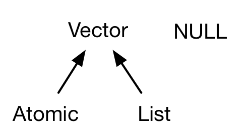
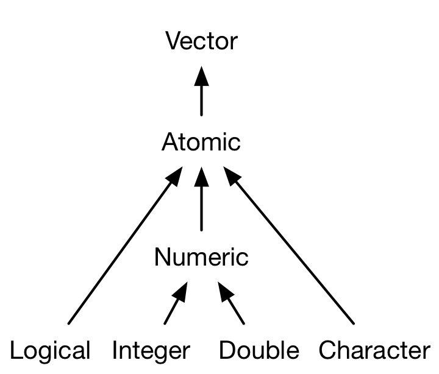
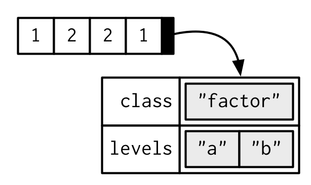
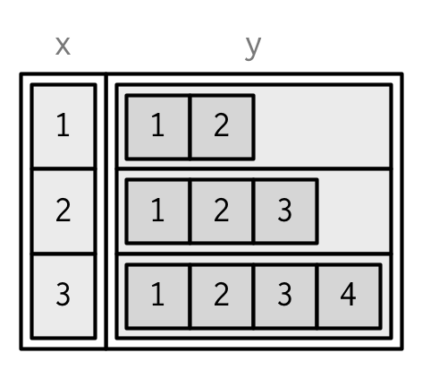

# Vectors {#vectors-chap}


## Introduction

This chapter discusses the most important family of data types in base R: the vector types[^node]. You've probably used many (if not all) of the vectors before, but you may not have thought deeply about how they are interrelated. In this chapter, I won't cover individual vectors types in too much depth. Instead, I'll show you how they fit together as a whole. If you need more details, you can find them in R's documentation.

[^node]: Collectively, all other data types are known as the "node" data types, and includes things like functions and environments. This is a highly technical term used in only a few places. The place where you're most likely to encounter it is the output of `gc()`: the "N" in `Ncells` stands for nodes, and the "V" in `Vcells` stands for vectors.

Vectors come in two flavours: atomic vectors and lists[^generic-vectors]. They differ in the types of their elements: all elements of an atomic vector must be the same type, whereas the elements of a list can have different types. Closely related to vectors is `NULL`; `NULL` is not a vector, but often serves the role of a generic 0-length vector. Throughout this chapter we'll expand on this diagram:



[^generic-vectors]: A few places in R's documentation call lists generic vectors to emphasise their difference from atomic vectors.

Every vector can also have __attributes__, which you can think of as a named list containing arbitrary metadata. Two attributes are particularly important because they create important vector variants. The **dim**ension attribute turns vectors into matrices and arrays. The __class__ attribute powers the S3 object system. You'll learn how to use S3 in Chapter \@ref(s3), but here, you'll learn about a handful of the most important S3 vectors: factors, date/times, data frames, and tibbles. Matrices and data frames are not necessarily what you think of a vectors, so you'll learn why these 2d structures are considered to be vectors in R.

### Quiz {-}

Take this short quiz to determine if you need to read this chapter. If the answers quickly come to mind, you can comfortably skip this chapter. You can check your answers in [answers](#data-structure-answers).

1. What are the four common types of atomic vectors? What are the two 
   rare types?

1. What are attributes? How do you get them and set them?

1. How is a list different from an atomic vector? How is a matrix different
   from a data frame?

1. Can you have a list that is a matrix? Can a data frame have a column 
   that is a matrix?
   
1. How do tibbles behave differently from data frames?

### Outline {-}

<!-- 
* [Vectors](#vectors) introduces you to atomic vectors and lists, R's 1d 
  data structures.
  
* [Attributes](#attributes) takes a small detour to discuss attributes,
  R's flexible metadata specification. Here you'll learn about factors,
  an important data structure created by setting attributes of an atomic 
  vector.
  
* [Matrices and arrays](#matrices-and-arrays) introduces matrices and arrays,
  data structures for storing 2d and higher dimensional data.
  
* [Data frames](#data-frames) teaches you about the data frame, the most
  important data structure for storing data in R. Data frames combine 
  the behaviour of lists and matrices to make a structure ideally suited for
  the needs of statistical data.
-->


## Atomic vectors
\index{atomic vectors} 
\index{vectors!atomic|see{atomic vectors}}
\indexc{NA}
\indexc{c()} 

There are four common types of atomic vectors: logical, integer, double, and character. Collectively integer and double vectors are known as numeric vectors[^numeric]. There are two rare types that I won't discuss further: complex and raw. Complex numbers are rarely needed for statistics, and raw vectors are a special type only needed when handling binary data. 



[^numeric]: This is a slight simplification as R does not use "numeric" consistently, which we'll come back to in Section \@ref(numeric-type).

### Scalars
\index{scalars}

Each of the four primary atomic vectors has special syntax to create an individual value, aka a __scalar__[^scalar], and its own missing value.:

* Strings are surrounded by `"` (`"hi"`) or `'` (`'bye'`). The string
  missing value is `NA_character_`. Special characters are escaped with `\\`;
  see `?Quotes` for full details.

* Doubles can be specified in decimal (`0.1234`), scientific (`1.23e4`), or 
  hexadecimal (`0xcafe`) forms. There are three special values unique to
  doubles: `Inf`, `-Inf`, and `NaN`. The double misssing value is `NA_real_`.
  
* Integers are written similarly to doubles but must be followed by `L`[^L-suffix]
  (`1234L`, `1e4L`, or `0xcafeL`), and can not include decimals. The integer
  missing value is `NA_integer_`.

* Logicals can be spelled out (`TRUE` or `FALSE`), or abbreviated (`T` or `F`).
  The logical missing value is `NA`.

[^L-suffix]: `L` is not intuitive, and you might wonder where it comes from. At the time `L` was added to R, R's integer type was equivalent to a long integer in C, and C code could use a suffix of `l` or `L` to force a number to be a long integer. It was decided that `l` was too visually similar to `i` (used for complex numbers in R), leaving `L`.

[^scalar]: Technically, the R language does not possess scalars, and everything that looks like a scalar is actually a vector of length one. This however, is mainly a theoretical distinction, and blurring the distinction between scalar and length-1 vector is unlikely to harm your code.

### Making longer vectors with `c()` {#atomic-constructing}
\indexc{typeof()}

To greater longer vectors from shorter vectors, use `c()`:


```r
dbl_var <- c(1, 2.5, 4.5)
int_var <- c(1L, 6L, 10L)
lgl_var <- c(TRUE, FALSE)
chr_var <- c("these are", "some strings")
```

In diagrams, I'll depict vectors as connected rectangles, so the above code could be drawn as follows:


You can determine the type of a vector with `typeof()` and its length with `length()`.


```r
typeof(dbl_var)
#> [1] "double"
typeof(int_var)
#> [1] "integer"
typeof(lgl_var)
#> [1] "logical"
typeof(chr_var)
#> [1] "character"
```

### Testing and coercing
\index{coercion}

Generally, you can __test__ if a vector is of a given type with an `is.` function, but they need to be used with care. `is.character()`, `is.double()`, `is.integer()`, and `is.logical()` do what you might expect: they test if a vector is a character, double, integer, or logical. Beware `is.vector()`, `is.atomic()`, and `is.numeric()`: they don't test if you have a vector, atomic vector, or numeric vector! We'll come back to what they actually do in Section \@ref(is-functions).

The type is a propety of the entire atomic vector, so all elements of an atomic must be the same type. When you attempt to combine different types they will be __coerced__ to the most flexible one (character >> double >> integer >> logical). For example, combining a character and an integer yields a character:


```r
str(c("a", 1))
#>  chr [1:2] "a" "1"
```

Coercion often happens automatically. Most mathematical functions (`+`, `log`, `abs`, etc.) will coerce to numeric. This particularly useful for logical vectors because `TRUE` becomes 1 and `FALSE` becomes 0.


```r
x <- c(FALSE, FALSE, TRUE)
as.numeric(x)
#> [1] 0 0 1

# Total number of TRUEs
sum(x)
#> [1] 1

# Proportion that are TRUE
mean(x)
#> [1] 0.333
```

Vectorised logical operations (`&`, `|`, `any`, etc) will coerce to a logical, but since this might lose information, it's always accompanied a warning.

Generally, you can deliberately coerce by using an `as.` function, like `as.character()`, `as.double()`, `as.integer()`, or `as.logical()`. Failed coercions from strings generate a warning and a missing value:


```r
as.integer(c("1", "1.5", "a"))
#> Warning: NAs introduced by coercion
#> [1]  1  1 NA
```

### Exercises

1. How do you create scalars of type raw and complex? (See `?raw` and 
   `?complex`)

1. Test your knowledge of vector coercion rules by predicting the output of
   the following uses of `c()`:

    
    ```r
    c(1, FALSE)
    c("a", 1)
    c(TRUE, 1L)
    ```

1. Why is `1 == "1"` true? Why is `-1 < FALSE` true? Why is `"one" < 2` false?

1. Why is the default missing value, `NA`, a logical vector? What's special
   about logical vectors? (Hint: think about `c(FALSE, NA_character_)`.)

## Attributes {#attributes}
\index{attributes}

You might have noticed that the set of atomic vectors does not include a number of important data structures like matrices and arrays, factors and date/times. These types are built on top of atomic vectors by adding attributes. In this section, you'll learn the basics of attributes, and how the dim attribute makes matrices and arrays. In the next section you'll learn how the class attribute is used to create S3 vectors, including factors, dates, and date-times.

### Getting and setting
\indexc{attr()}
\indexc{attributes()}
\indexc{structure()}

You can think of attributes as a named list[^pairlist] used to attach metadata to an object. Individual attributes can be retrieved and modified with `attr()`, or retrieved en masse with `attributes()`, and set en masse with `structure()`. 

[^pairlist]: The reality is a little more complicated: attributes are actually stored in pairlists. Pairlists are functionally indistinguisable from lists, but are profoundly different under the hood, and you'll learn more about them in Section \@ref(pairlists). 


```r
a <- 1:3
attr(a, "x") <- "abcdef"
attr(a, "x")
#> [1] "abcdef"

attr(a, "y") <- 4:6
str(attributes(a))
#> List of 2
#>  $ x: chr "abcdef"
#>  $ y: int [1:3] 4 5 6

# Or equivalently
a <- structure(
  1:3, 
  x = "abcdef",
  y = 4:6
)
str(attributes(a))
#> List of 2
#>  $ x: chr "abcdef"
#>  $ y: int [1:3] 4 5 6
```


Attributes should generally be thought of as ephemeral. For example, most attributes are lost by most operations:


```r
attributes(a[1])
#> NULL
attributes(sum(a))
#> NULL
```

There are only two attributes that are routinely preserved: 

* __names__, a character vector giving each element a name.
* __dims__, short for dimensions, an integer vector, used to turn vectors 
  into matrices and arrays.

To preserve additional attributes, you'll need to create your own S3 class, the topic of Chapter \@ref(s3).

### Names {#attr-names}
\index{attributes!names}
\indexc{names()}
\indexc{setNames()}
 
You can name a vector in three ways:


```r
# When creating it: 
x <- c(a = 1, b = 2, c = 3)

# By assigning names() to an existing vector:
x <- 1:3
names(x) <- c("a", "b", "c")

# Inline, with setNames():
x <- setNames(1:3, c("a", "b", "c"))
```

Avoid using `attr(x, "names")` as it more typing and less readable than `names(x)`. You can remove names from a vector by using `unname(x)` or `names(x) <- NULL`. 

To be technically correct, when drawing the named vector `x`, I should draw it like so:


However, names are so special and so important, that unless I'm trying specifically to draw attention to the attributes data structure, I'll use them to label the vector directly:


To be maximally useful for character subsetting (e.g. Section \@ref(lookup-tables)) names should be unique, and non-missing, but this is not enforced by R. Depending on how the names are set, missing names may be either `""` or `NA_character_`. If all names are missing, `names()` will return `NULL`.

### Dimensions {#attr-dims}
\index{arrays} 
\index{matrices|see{arrays}}

Adding a `dim` attribute to a vector allows it to behave like a 2-dimensional __matrix__ or multi-dimensional __array__. Matrices and arrays are primarily a mathematical/statistical tool, not a programming tool, so will be used infrequently in this book, and only covered briefly. Their most important feature of is multidimensional subsetting, which is covered in Section \@ref(matrix-subsetting).

You can create matrices and arrays with `matrix()` and `array()`, or by using the assignment form of `dim()`:


```r
# Two scalar arguments specify row and column sizes
a <- matrix(1:6, nrow = 2, ncol = 3)
a
#>      [,1] [,2] [,3]
#> [1,]    1    3    5
#> [2,]    2    4    6

# One vector argument to describe all dimensions
b <- array(1:12, c(2, 3, 2))
b
#> , , 1
#> 
#>      [,1] [,2] [,3]
#> [1,]    1    3    5
#> [2,]    2    4    6
#> 
#> , , 2
#> 
#>      [,1] [,2] [,3]
#> [1,]    7    9   11
#> [2,]    8   10   12

# You can also modify an object in place by setting dim()
c <- 1:6
dim(c) <- c(3, 2)
c
#>      [,1] [,2]
#> [1,]    1    4
#> [2,]    2    5
#> [3,]    3    6
```

Many of the functions for working with vectors have generalisations for matrices and arrays:

| Vector            | Matrix                     | Array            |
|-------------------|----------------------------|------------------|
| `names()`         | `rownames()`, `colnames()` | `dimnames()`     |
| `length()`        | `nrow()`, `ncol()`         | `dim()`          |
| `c()`             | `rbind()`, `cbind()`       | `abind::abind()` |
| ---               | `t()`                      | `aperm()`        |
| `is.null(dim(x))` | `is.matrix()`              | `is.array()`     |

A vector without `dim` attribute set is often thought of as 1-dimensional, but actually has a `NULL` dimensions. You also can have matrices with a single row or single column, or arrays with a single dimension. They may print similarly, but will behave differently. The differences aren't too important, but it's useful to know they exist in case you get strange output from a function (`tapply()` is a frequent offender). As always, use `str()` to reveal the differences.


```r
str(1:3)                   # 1d vector
#>  int [1:3] 1 2 3
str(matrix(1:3, ncol = 1)) # column vector
#>  int [1:3, 1] 1 2 3
str(matrix(1:3, nrow = 1)) # row vector
#>  int [1, 1:3] 1 2 3
str(array(1:3, 3))         # "array" vector
#>  int [1:3(1d)] 1 2 3
```

### Exercises

1.  How is `setNames()` implemented? How is `unname()` implemented?
    Read the source code.

1.  What does `dim()` return when applied to a 1d vector?
    When might you use `NROW()` or `NCOL()`?

1.  How would you describe the following three objects? What makes them
    different to `1:5`?

    
    ```r
    x1 <- array(1:5, c(1, 1, 5))
    x2 <- array(1:5, c(1, 5, 1))
    x3 <- array(1:5, c(5, 1, 1))
    ```

1.  An early draft used this code to illustrate `structure()`:

    
    ```r
    structure(1:5, comment = "my attribute")
    #> [1] 1 2 3 4 5
    ```

    But when you print that object you don't see the comment attribute.
    Why? Is the attribute missing, or is there something else special about
    it? (Hint: try using help.)

## S3 atomic vectors

One of the most important attributes is `class`, which defines the S3 object system. Having a class attribute makes an object an __S3 object__, which means that it will behave differently when passed to a __generic__ function. Every S3 object is built on top of a base type, and often stores additional information in other attributes. You'll learn the details of the S3 object system, and how to create your own S3 classes, in Chapter \@ref(s3). 

In this section, we'll discuss three important S3 vectors used in base R:

* Categorical data, where values can only come from a fixed set of levels,  
  are recorded in __factor__ vectors.

* Dates (with day resolution) are recorded are __Date__ vectors.

* Date-times (with second or sub-second) resolution are stored in
  __POSIXct__ vectors.


### Factors
\index{factors}
\indexc{stringsAsFactors}
 
A factor is a vector that can contain only predefined values, and is used to store categorical data. Factors are built on top of integer vectors with two attributes: the `class`, "factor", which makes them behave differently from regular integer vectors, and the `levels`, which defines the set of allowed values.


```r
x <- factor(c("a", "b", "b", "a"))
x
#> [1] a b b a
#> Levels: a b

typeof(x)
#> [1] "integer"
attributes(x)
#> $levels
#> [1] "a" "b"
#> 
#> $class
#> [1] "factor"
```


Factors are useful when you know the set of possible values, even if you don't see them all in a given dataset. Compared to a character vector, this means that tabulating a factor can yield counts of 0:


```r
sex_char <- c("m", "m", "m")
sex_factor <- factor(sex_char, levels = c("m", "f"))

table(sex_char)
#> sex_char
#> m 
#> 3
table(sex_factor)
#> sex_factor
#> m f 
#> 3 0
```

A minor variation or factors is __ordered__ factors, which generally behave similarly, but declare that the order of the levels is meaningful (a fact which is used automatically in some models and visualisations).


```r
grade <- ordered(c("b", "b", "a", "c"), levels = c("c", "b", "a"))
grade
#> [1] b b a c
#> Levels: c < b < a
```

With base R[^tidyverse-factors] you tend to encouter factors very frequently, because many base R functions (like `read.csv()` and `data.frame()`) automatically convert character vectors to factors. This is suboptimal, because there's no way for those functions to know the set of all possible levels or their optimal order: the levels are a property of the experimental design, not the data. Instead, use the argument `stringsAsFactors = FALSE` to suppress this behaviour, and then manually convert character vectors to factors using your knowledge of the data. To learn about the historical context of this behaviour, I recommend [*stringsAsFactors: An unauthorized
biography*](http://simplystatistics.org/2015/07/24/stringsasfactors-an-unauthorized-biography/) by Roger Peng, and [*stringsAsFactors = 
\<sigh\>*](http://notstatschat.tumblr.com/post/124987394001/stringsasfactors-sigh) by Thomas Lumley.

[^tidyverse-factors]: The tidyverse never automatically coerce characters to factor, and provides the forcats [@forcats] package specifically for working with factors.

While factors look like (and often behave like) character vectors, they are built on top of integers. Be careful when treating them like strings. Some string methods (like `gsub()` and `grepl()`) will coerce factors to strings automatically, while others (like `nchar()`) will throw an error, and still others (like `c()`) will use the underlying integer values. For this reason, it's usually best to explicitly convert factors to character vectors if you need string-like behaviour.

### Dates

Date vectors are built on top of double vectors. They have class "Date" and no other attributes:


```r
today <- Sys.Date()

typeof(today)
#> [1] "double"
attributes(today)
#> $class
#> [1] "Date"
```

The value of the double (which can be seen by stripping the class), represents the number of days since 1970-01-01:


```r
date <- as.Date("1970-02-01")
unclass(date)
#> [1] 31
```

### Date-times

Base R[^tidyverse-datetimes] provides two ways of storing date-time information, POSIXct, and POSIXlt. These are admittedly odd names: "POSIX" is short for Portable Operating System Interface which is a family of cross-platform standards. "ct" standards for calendar time (the `time_t` type in C), and "lt" for local time (the `struct tm` type in C). Here we'll focus on `POSIXct`, because it's the simplest, is built on top of an atomic vector, and is most appropriate for use in data frames. POSIXct vectors are built on top of double vectors, where the value represents the number of days since 1970-01-01.


```r
now_ct <- as.POSIXct("2018-08-01 22:00", tz = "UTC")
now_ct
#> [1] "2018-08-01 22:00:00 UTC"

typeof(now_ct)
#> [1] "double"
attributes(now_ct)
#> $class
#> [1] "POSIXct" "POSIXt" 
#> 
#> $tzone
#> [1] "UTC"
```

The `tzone` attribute controls how the date-time is formatted, not the instant of time represented by the vector. Note that the time is not printed if it is midnight.


```r
structure(now_ct, tzone = "Asia/Tokyo")
#> [1] "2018-08-02 07:00:00 JST"
structure(now_ct, tzone = "America/New_York")
#> [1] "2018-08-01 18:00:00 EDT"
structure(now_ct, tzone = "Australia/Lord_Howe")
#> [1] "2018-08-02 08:30:00 +1030"
structure(now_ct, tzone = "Europe/Paris")
#> [1] "2018-08-02 CEST"
```

[^tidyverse-datetimes] The tidyverse provides the lubridate [@lubridate] package for working with date-times. It provides a number of convenient helpers all which work with the base POSIXct type.

### Exercises

1.  What sort of object does `table()` return? What is its type? What 
    attributes does it have? How does the dimensionality change as you
    tabulate more variables?

1.  What happens to a factor when you modify its levels? 
    
    
    ```r
    f1 <- factor(letters)
    levels(f1) <- rev(levels(f1))
    ```

1.  What does this code do? How do `f2` and `f3` differ from `f1`?

    
    ```r
    f2 <- rev(factor(letters))
    
    f3 <- factor(letters, levels = rev(letters))
    ```


## Lists
\index{lists} 
\index{vectors!lists|see{lists}}

Lists are a step up in complexity from atomic vectors because an element of a list can be any type (not just vectors). An element of a list can even be another list!

### Creating {#list-creating}

Construct lists with `list()`: 


```r
l1 <- list(
  1:3, 
  "a", 
  c(TRUE, FALSE, TRUE), 
  c(2.3, 5.9)
)

typeof(l1)
#> [1] "list"

str(l1)
#> List of 4
#>  $ : int [1:3] 1 2 3
#>  $ : chr "a"
#>  $ : logi [1:3] TRUE FALSE TRUE
#>  $ : num [1:2] 2.3 5.9
```

As described in Section \@ref(list-references), the elements of a list are references. Creating a list does not copy the components in, so the total size of a list might be smaller than you expect.


```r
lobstr::obj_size(mtcars)
#> 7,792 B

l2 <- list(mtcars, mtcars, mtcars, mtcars)
lobstr::obj_size(l2)
#> 7,872 B
```

Lists can contain complex objects so it's not possible to pick one visual style that works for every list. Generally I'll draw lists like vectors, using colour to remind you of the hierarchy.


Lists are sometimes called __recursive__ vectors, because a list can contain other lists. This makes them fundamentally different from atomic vectors.


```r
l3 <- list(list(list(1)))
str(l3)
#> List of 1
#>  $ :List of 1
#>   ..$ :List of 1
#>   .. ..$ : num 1
```


`c()` will combine several lists into one. If given a combination of atomic vectors and lists, `c()` will coerce the vectors to lists before combining them. Compare the results of `list()` and `c()`:


```r
l4 <- list(list(1, 2), c(3, 4))
l5 <- c(list(1, 2), c(3, 4))
str(l4)
#> List of 2
#>  $ :List of 2
#>   ..$ : num 1
#>   ..$ : num 2
#>  $ : num [1:2] 3 4
str(l5)
#> List of 4
#>  $ : num 1
#>  $ : num 2
#>  $ : num 3
#>  $ : num 4
```


### Testing and coercing {#list-types}

The `typeof()` a list is `list`. You can test for a list with `is.list()`.

And coerce to a list with `as.list()`. 


```r
list(1:3)
#> [[1]]
#> [1] 1 2 3
as.list(1:3)
#> [[1]]
#> [1] 1
#> 
#> [[2]]
#> [1] 2
#> 
#> [[3]]
#> [1] 3
```

You can turn a list into an atomic vector with `unlist()`. The rules for the resulting type are complex, not well documented, and not always equivalent to `c()`. 

### Matrices and arrays {#list-array}
\index{list-arrays}
\index{arrays!list-arrays} 

While atomic vectors are most commonly turned into matrices, the dimension attribute can also be set on lists to make list-matrices or list-arrays: 


```r
l <- list(1:3, "a", TRUE, 1.0)
dim(l) <- c(2, 2)
l
#>      [,1]      [,2]
#> [1,] Integer,3 TRUE
#> [2,] "a"       1

l[[1, 1]]
#> [1] 1 2 3
```

These are relatively esoteric data structures, but can be useful if you want to arrange objects into a grid-like structure. For example, if you're running models on a spatio-temporal grid, it might be natural to preserve the grid structure by storing the models in a 3d array. 

### Exercises

1.  List all the ways that a list differs from an atomic vector?

1.  Why do you need to use `unlist()` to convert a list to an 
    atomic vector? Why doesn't `as.vector()` work? 

1.  Compare and contrast `c()` and `unlist()` when combining a 
    date and date-time into a single vector.

## Data frames and tibbles {#tibble}
\index{data frames}
\index{tibbles}

There are two important S3 vectors that are built on top of lists: data frames and tibbles.


A data frame is the most common way of storing data in R, and is crucial for effective data analysis. A data frames is a named list of equal-length vectors. It has attributes providing the (column) `names`, `row.names`[^rownames], and a class of "data.frame": 


```r
df1 <- data.frame(x = 1:2, y = 2:1)
typeof(df1)
#> [1] "list"

attributes(df1)
#> $names
#> [1] "x" "y"
#> 
#> $class
#> [1] "data.frame"
#> 
#> $row.names
#> [1] 1 2
```

[^rownames]: Row names are one of the most suprisingly complex data structures in R, because they've been persistent performance issue over many years. The most straightforward representations are character or integer vectors, with one element for each row. There's also a compact representation for "automatic" row names (consecutive integers), created by `.set_row_names()`. R 3.5 has a special way of deferring integer to character conversions specifically to speed up `lm()`; see <https://svn.r-project.org/R/branches/ALTREP/ALTREP.html#deferred_string_conversions> for details.

Because each element of the list has the same length, data frames have a rectangular structure, and hence shares properties of both the matrix and the list:

* A data frame has 1d `names()`, and 2d `colnames()` and
  `rownames()`[^row.names]. The `names()` and `colnames()` are identical.
  
* A data frame has 1d `length()`, and 2d `ncol()` and `nrow()`.
  The `length()` is the number of columns.

[^row.names]: Technically, you are encouraged to use `row.names()`, not `rownames()` with data frames, but this distinction is rarely important.

Data frames are one of the biggest and most important ideas in R, and one of the things that makes R different from other programming languages. However, in the over 20 years since their creation, the ways people use R have changed, and some of the design decisions that made sense at the time data frames were created now cause frustration.

This frustration lead to the creation of the tibble [@tibble], a modern reimagining of the data frame. Tibbles are designed to be (as much as possible) drop-in replacements for data frames, while still fixing the greatest frustrations. A concise, and fun, way to summarise the main differences is that tibbles are lazy and surly: they tend to do less and complain more. You'll see what that means as you work through this section.

Tibbles are provided by the tibble package and share the the same structure as a data frame. The only difference is that the class vector is longer, and includes `tbl_df`. This allows tibbles to behave differently in the key ways which we'll discuss below.


```r
library(tibble)

df2 <- tibble(x = 1:2, y = 2:1)
typeof(df2)
#> [1] "list"

attributes(df2)
#> $names
#> [1] "x" "y"
#> 
#> $row.names
#> [1] 1 2
#> 
#> $class
#> [1] "tbl_df"     "tbl"        "data.frame"
```

When drawing data frames and tibbles, rather than focussing on the implementation details, i.e. the attributes:


I'll draw them in the same way as a named list, but arranged to emphasised their columnar structure.


### Creating {#df-create}
\indexc{stringsAsFactors}
\indexc{data.frame()}
\indexc{tibble()}

You create a data frame by supplying name-vector pairs to `data.frame()`:


```r
df <- data.frame(
  x = 1:3, 
  y = c("a", "b", "c")
)
str(df)
#> 'data.frame':	3 obs. of  2 variables:
#>  $ x: int  1 2 3
#>  $ y: Factor w/ 3 levels "a","b","c": 1 2 3
```

Beware the default conversion of strings to factors. Use `stringsAsFactors = FALSE` to suppress it and keep character vectors as character vectors:


```r
df1 <- data.frame(
  x = 1:3,
  y = c("a", "b", "c"),
  stringsAsFactors = FALSE
)
str(df1)
#> 'data.frame':	3 obs. of  2 variables:
#>  $ x: int  1 2 3
#>  $ y: chr  "a" "b" "c"
```

Creating a tibble is similar, but tibbles never coerce their input (this is one feature that makes them lazy):


```r
df2 <- tibble(
  x = 1:3, 
  y = c("a", "b", "c")
)
str(df2)
#> Classes 'tbl_df', 'tbl' and 'data.frame':	3 obs. of  2 variables:
#>  $ x: int  1 2 3
#>  $ y: chr  "a" "b" "c"
```

Additionally, while data frames automatically transform non-syntactic names (unless `check.names = FALSE`); tibbles do not (although they do print non-syntactic names surrounded by `` ` ``).


```r
names(data.frame(`1` = 1))
#> [1] "X1"

names(tibble(`1` = 1))
#> [1] "1"
```

While every element of a data frame (or tibble) must have the same length, both `data.frame()` and `tibble()` can recycle shorter inputs. Data frames automatically recycle columns that are an integer multiple of the longest column; tibbles only ever recycle vectors of length 1.


```r
data.frame(x = 1:4, y = 1:2)
#>   x y
#> 1 1 1
#> 2 2 2
#> 3 3 1
#> 4 4 2
data.frame(x = 1:4, y = 1:3)
#> Error in data.frame(x = 1:4, y = 1:3):
#>   arguments imply differing number of rows: 4, 3

tibble(x = 1:4, y = 1)
#> # A tibble: 4 x 2
#>       x     y
#>   <int> <dbl>
#> 1     1     1
#> 2     2     1
#> 3     3     1
#> 4     4     1
tibble(x = 1:4, y = 1:2)
#> Error: Column `y` must be length 1 or 4, not 2
```

There is one final difference: `tibbles()` allow you to refer to newly created variables:


```r
tibble(
  x = 1:3,
  y = x * 2
)
#> # A tibble: 3 x 2
#>       x     y
#>   <int> <dbl>
#> 1     1     2
#> 2     2     4
#> 3     3     6
```


### Row names {#rownames}

Data frames allow you to label each row with a "name", a character vector containing only unique values:


```r
df3 <- data.frame(
  age = c(35, 27, 18),
  hair = c("blond", "brown", "black"),
  row.names = c("Bob", "Susan", "Sam")
)
df3
#>       age  hair
#> Bob    35 blond
#> Susan  27 brown
#> Sam    18 black
```

You can get and set row names with `rownames()`, and you can use them to subset rows:


```r
rownames(df3)
#> [1] "Bob"   "Susan" "Sam"

df3["Bob", ]
#>     age  hair
#> Bob  35 blond
```

Row names arise naturally if you think of data frames as 2d structures like matrices: the columns (variables) have names so the rows (observations) should too. Most matrices are numeric, so having a place to store character labels is important. But this analogy to matrices is misleading because matrices possess an important property that data frames do not: they are transposable. In matrices the rows and columns are interchangeable, and transposing a matrix gives you another matrix (and transposing again gives you back the original matrix). With data frames, however, the rows and columns are not interchangeable, and the transpose of a data frame is not a data frame.

There are three reasons that row names are them suboptimal:

*   Metadata is data, so storing it in a different way to the rest of the 
    data is fundamentally a bad idea. It also means that you need to learn
    a new set of tools to work with row names; you can't use what you already 
    know about manipulating columns.
 
*   Row names are poor abstraction for labelling rows because they only work 
    when a row can be identified by a single string. This fails in many cases,
    for example when you want to identify a row by a non-character vector 
    (e.g. a time point), or with multiple vectors (e.g. position, encoded by
    latitidue and longitude).
    
*   Row names must be unique, so any replication of rows (e.g. from 
    bootstrapping) will create new row names. If you want to match rows from 
    before and after the transformation you'll need to perform complicated 
    string surgery.

    
    ```r
    df3[c(1, 1, 1), ]
    #>       age  hair
    #> Bob    35 blond
    #> Bob.1  35 blond
    #> Bob.2  35 blond
    ```

For these reasons, tibbles do not support row names. Instead tibble package provides tools to easily convert row names into a regular column with either `rownames_to_column()`, or the `rownames` argument to `as_tibble()`:


```r
as_tibble(df3, rownames = "name")
#> # A tibble: 3 x 3
#>   name    age hair 
#>   <chr> <dbl> <fct>
#> 1 Bob      35 blond
#> 2 Susan    27 brown
#> 3 Sam      18 black
```

### Printing 

One of the most obvious differences between tibbles and data frames is how they are printed. I assume that youu're already familiar with how data frames are printed, so here I'll highlight some of the biggest differences using an example dataset included in the dplyr package:


```r
dplyr::starwars
#> # A tibble: 87 x 13
#>    name  height  mass hair_color skin_color eye_color birth_year gender
#>    <chr>  <int> <dbl> <chr>      <chr>      <chr>          <dbl> <chr> 
#>  1 Luke…    172    77 blond      fair       blue            19   male  
#>  2 C-3PO    167    75 <NA>       gold       yellow         112   <NA>  
#>  3 R2-D2     96    32 <NA>       white, bl… red             33   <NA>  
#>  4 Dart…    202   136 none       white      yellow          41.9 male  
#>  5 Leia…    150    49 brown      light      brown           19   female
#>  6 Owen…    178   120 brown, gr… light      blue            52   male  
#>  7 Beru…    165    75 brown      light      blue            47   female
#>  8 R5-D4     97    32 <NA>       white, red red             NA   <NA>  
#>  9 Bigg…    183    84 black      light      brown           24   male  
#> 10 Obi-…    182    77 auburn, w… fair       blue-gray       57   male  
#> # ... with 77 more rows, and 5 more variables: homeworld <chr>,
#> #   species <chr>, films <list>, vehicles <list>, starships <list>
```

Tibbles:

* Only show the first 10 rows and all the columns that will fit on screen.
  Additional columns are shown at the bottom.

* Each column is labelled with its type, abbreviated to three or four letters.

* Wide columns are truncated to avoid a single long string occupying an entire
  row. (This is still a work in progress: it's tricky to get the tradeoff 
  right between showing as many columns as possible and showing a single wide 
  column fully.)

* When used in console environments that support it, colour is used judiciously 
  to highlight important information, and de-emphasise supplemental details.

### Subsetting {#safe-subsetting}

As you will learn in Chapter \@ref(subsetting), you can subset a data frame or a tibble like a 1d structure (where it behaves like a list), or a 2d structure (where it behaves like a matrix). 

In my opinion, data frames have two suboptimal subsetting behaviours:

* When you subset columns with `df[, vars]`, you will get a vector if `vars`
  selects one variable, otherwise you'll get a data frame. This is a frequent 
  source of bugs when using `[` in a function, unless you always remember to 
  do `df[, vars, drop = FALSE]`.
  
* When you attempt to extract a single column with `df$x` and there is no 
  column `x`, a data frame will instead select any variable that starts with
  `x`. If no variable starts with `x`, `df$x` will return `NULL`. This makes
  it easy to select the wrong variable or to select a variable that doesn't
  exist.

Tibbles tweak these behaviours so that `[` always returns a tibble, and `$` doesn't partial match, and warns if it can't find a variable (this is what makes tibbles surly).


```r
df1 <- data.frame(xyz = "a")
df2 <- tibble(xyz = "a")

str(df1$x)
#>  Factor w/ 1 level "a": 1
str(df2$x)
#> Warning: Unknown or uninitialised column: 'x'.
#>  NULL
```


A tibble's insistence on returning a data frame from `[` can cause problems with legacy code, which often uses `df[, "col"]` to extract a single column. To fix this, use `df[["col"]]` instead; this is more expressive (since `[[` always extracts a single element) and works with both data frames and tibbles.

### Testing and coercing {#df-test-coerce}
\indexc{is.data.frame()}
\indexc{is\_tibble()}
\indexc{as.data.frame()}
\indexc{as\_tibble()}

To check if an object is a data frame or tibble, use `is.data.frame()`:


```r
is.data.frame(df1)
#> [1] TRUE
is.data.frame(df2)
#> [1] TRUE
```

Typically, it should not matter if you have a tibble or data frame, but if you do need to distinguish, use `is_tibble()`:


```r
is_tibble(df1)
#> [1] FALSE
is_tibble(df2)
#> [1] TRUE
```

You can coerce an object to a data frame with `as.data.frame()` or to as tibble with `as_tibble()`.

### List columns
\index{data frames!list-column}
\indexc{I()}

Since a data frame is a list of vectors, it is possible for a data frame to have a column that is a list. This very useful because a list can contain any other object, which means that you can put any object in a data frame. This allows you to keep related objects together in a row, no matter how complex the individual objects are. You can see an application of this in the "Many Models" chapter of "R for Data Sicence", <http://r4ds.had.co.nz/many-models.html>.

List-columns are allowed in data frames but you have to do a little extra work, either adding the list-column after creation, or wrapping the list in `I()`.


```r
df <- data.frame(x = 1:3)
df$y <- list(1:2, 1:3, 1:4)

data.frame(
  x = 1:3, 
  y = I(list(1:2, 1:3, 1:4))
)
#>   x          y
#> 1 1       1, 2
#> 2 2    1, 2, 3
#> 3 3 1, 2, 3, 4
```



List columns are easier to use with tibbles because you can provide them inside `tibble()`, are they are handled specially when printing:


```r
tibble(
  x = 1:3, 
  y = list(1:2, 1:3, 1:4)
)
#> # A tibble: 3 x 2
#>       x y        
#>   <int> <list>   
#> 1     1 <int [2]>
#> 2     2 <int [3]>
#> 3     3 <int [4]>
```

### Matrix and data frame columns
\index{data frames!matrix-column}

It's also possible to have a column of a data frame that's a matrix or array, as long as the number of rows matches the data frame.  (This requires a slight extention to our definition of a data frame: it's not the `length()` of each column that must be equal; but the `NROW()`.) Like with list-columns, you must either add after creation, or wrap in `I()`.


```r
dfm <- data.frame(
  x = 1:3 * 10
)
dfm$y <- matrix(1:9, nrow = 3)
dfm$z <- data.frame(a = 3:1, b = letters[1:3], stringsAsFactors = FALSE)

str(dfm)
#> 'data.frame':	3 obs. of  3 variables:
#>  $ x: num  10 20 30
#>  $ y: int [1:3, 1:3] 1 2 3 4 5 6 7 8 9
#>  $ z:'data.frame':	3 obs. of  2 variables:
#>   ..$ a: int  3 2 1
#>   ..$ b: chr  "a" "b" "c"
```


Matrix and data frame columns require a little caution. Many functions that work with data frames assume that all columns are vectors, and the printed display can be confusing.


```r
dfm[1, ]
#>    x y.1 y.2 y.3 z.a z.b
#> 1 10   1   4   7   3   a
```

### Exercises

1.  Can you have a data frame with 0 rows? What about 0 columns?

1.  What happens if you attempt to set rownames that are not unique?

1.  If `df` is a data frame, what can you say about `t(df)`, and `t(t(df))`? 
    Perform some experiments, making sure to try different column types.

1.  What does `as.matrix()` do when applied to a data frame with 
    columns of different types? How does it differ from `data.matrix()`?

## `NULL`

To finish up the chapter, I wanted to talk about a final important data struture that's closely related to vectors: `NULL`. `NULL` is special because it has a unique type, is always length 0, and can't have any attributes:


```r
typeof(NULL)
#> [1] "NULL"

length(NULL)
#> [1] 0

x <- NULL
attr(x, "y") <- 1
#> Error in attr(x, "y") <- 1:
#>   attempt to set an attribute on NULL
```

You can test for `NULL`s with `is.null()`:


```r
is.null(NULL)
#> [1] TRUE
```

There are two common uses of `NULL`:

*   To represent an empty vector (a vector of length 0) of arbitrary type.
    For example, if you use `c()` but don't include any arguments, you get 
    `NULL`, and concatenating `NULL` to a vector leaves it unchanged[^identity]:
    
    
    ```r
    c()
    #> NULL
    ```

*   To represent an absent vector. For example, `NULL` is often used as a 
    default function argument, when the argument is optional but the default 
    value requires some computation (see Section \@ref(missing-arguments) for
    more on this idea). Contrast this with `NA` which is used to indicate that 
    an _element_ of a vector is absent. 

[^identity]: Algebraically, this makes `NULL` the identity element under vector concatenation.

If you're familiar with SQL, you know about relational `NULL` and might expect it to be the same as Rs. However, the database `NULL` is actually equivalent to `NA`.

## Answers {#data-structure-answers}

1.  The four common types of atomic vector are logical, integer, double 
    and character. The two rarer types are complex and raw.
    
1.  Attributes allow you to associate arbitrary additional metadata to
    any object. You can get and set individual attributes with `attr(x, "y")`
    and `attr(x, "y") <- value`; or get and set all attributes at once with
    `attributes()`.

1.  The elements of a list can be any type (even a list); the elements of 
    an atomic vector are all of the same type. Similarly, every element of 
    a matrix must be the same type; in a data frame, the different columns 
    can have different types.
    
1.  You can make "list-array" by assigning dimensions to a list. You can
    make a matrix a column of a data frame with `df$x <- matrix()`, or
    using `I()` when creating a new data frame `data.frame(x = I(matrix()))`.

1.  Tibbles have an enhanced print method, never coerce strings to factors,
    and provide stricter subsetting methods.
